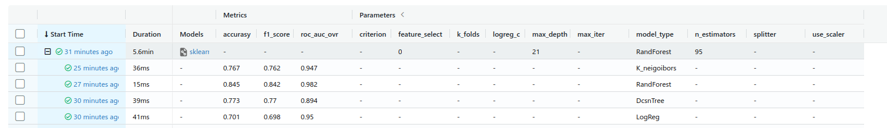
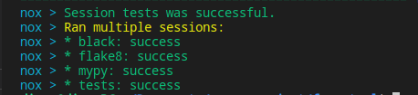

## Code checking status:
[](https://github.com/N3wBaz/forest_project/actions/workflows/checks.yml)

Capstone homework project for RS School Machine Learning course.

This project uses [Forest Cover Type Prediction](https://www.kaggle.com/competitions/forest-cover-type-prediction) dataset.

## Usage
This package allows you to train model for predict the forest cover type (the predominant kind of tree cover) from strictly cartographic variables
1. Create project with poetry
2. Download [Forest Cover Type Prediction](https://www.kaggle.com/competitions/forest-cover-type-prediction/data) dataset, save csv locally (default path is *data/forest.csv* in repository's root).
3. Make sure Python 3.8 (or higher) and [Poetry](https://python-poetry.org/docs/) are installed on your machine (I use Poetry 1.1.13).
4. Install project dependencies. You should run this terminal command in a root of repository:
```sh 
poetry install --no-dev
```
5. Run train with the followong command with deafaul options such as random_state, etc.
Default list of options for train:
   * -d, --dataset-path     :   data/train.csv
   * -s, --save-model-path  :   data/model.joblib
   * --feature-select       :   0 (0 - without any selection,
                                   1 - select with ExtraTreesClassifier,
                                   2 - select with Boruta)
   * --random-state         :   42
   * --use-scaler           :   True
   * --max-iter             :   100
   * --logreg-c             :   1.0
   * --kf-part              :   5
   * --other-model          :   False (default model: - LogisticRegression, if True: DecisionTreeClassifier)
   * --criterion            :   gini  (use for DecisionTreeClassifier) 
   * --splitter             :   best  (use for DecisionTreeClassifier) 
   * --max-depth            :   5     (use for DecisionTreeClassifier) 

```sh 
poetry run train -d <path to dataset in csv format> -s <path to save trained model>
```
You can configure additional option in the CLI. To get full list of them, use help:
```sh 
poetry run train --help
```
For training with automatic search best model and parameters with Nested cross-validation use:
```sh 
poetry run train_nested_cv
```
You can use defaul options or yours:
   * -d, --dataset-path     :   data/train.csv
   * -s, --save-model-path  :   data/model.joblib
   * --feature-select       :   0 (0 - without any selection,
                                   1 - select with ExtraTreesClassifier,
                                   2 - select with Boruta)
   * --random-state         :   42

6. Run pandas profiling report with EDA which will saved in the root directory with name "Forest_report.html":
```sh 
poetry run eda
```
7. Run MLflow UI to see the information about experiment you counducted:
```sh 
poetry run mlflow ui
```
8. Screeshot for result of training with different parameters ,metrics and models from MLflow.

    Part for LogisticRegression model with 3 different parameters and 2 feature engineering techniques (feature selection in this case)

    Part for DecisionTree model with 3 different parameters and 2 feature engineering techniques (feature selection in this case)


9. Screenshot for training with automatic search best model and parameters from Mlflow with Nested CV.


## Development

10. The code in this repository must be tested, formatted with black, flake8 and pass mypy typechecking before being commited to the repository. 
Install all requirements (including dev requirements) to poetry environment:
```sh 
poetry install
```
Now you can use developer instruments, e.g. black
```sh 
poetry run black src/forest_ml
```
or pytest:
```sh 
poetry run pytest
```
or flake8:
```sh 
poetry run flake8 src/forest_ml
```
You can combine all checks and tests in one with nox:
```sh 
poetry run nox
```
11-13. Results of checking with flaske8, black and mypy


14. Results of combine all checks in one with nox helping.



