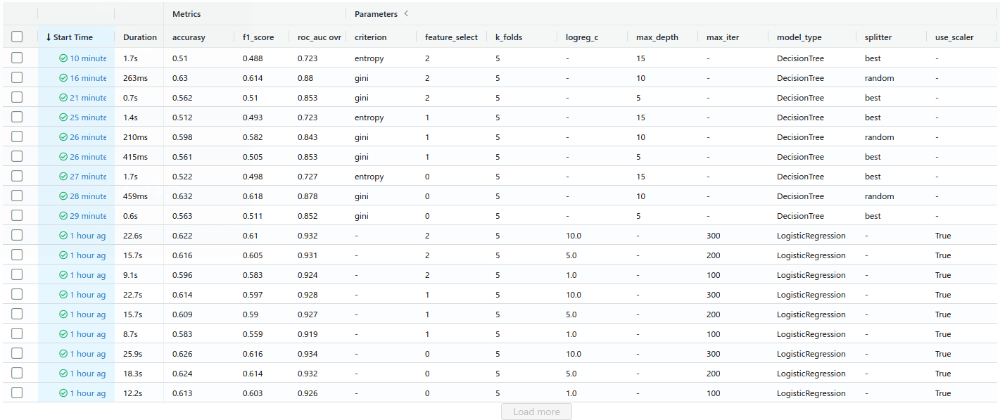
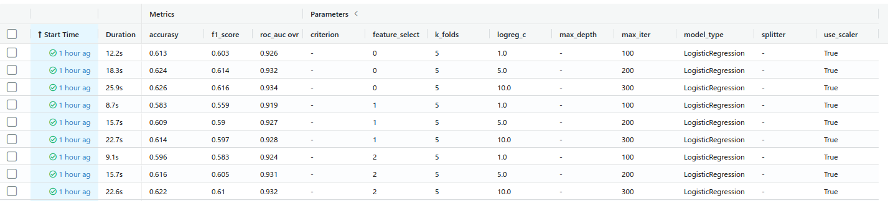
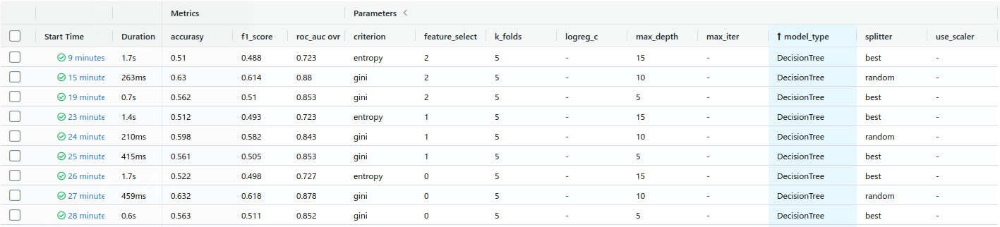
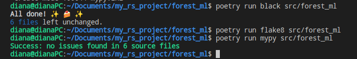
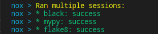

Capstone homework project for RS School Machine Learning course.

This project uses [Forest Cover Type Prediction](https://www.kaggle.com/competitions/forest-cover-type-prediction) dataset.

## Usage
This package allows you to train model for predict the forest cover type (the predominant kind of tree cover) from strictly cartographic variables
1. Create project with poetry
2. Download [Forest Cover Type Prediction](https://www.kaggle.com/competitions/forest-cover-type-prediction/data) dataset, save csv locally (default path is *data/forest.csv* in repository's root).
3. Make sure Python 3.8(3.9) and [Poetry](https://python-poetry.org/docs/) are installed on your machine (I use Poetry 1.1.13).
4. Install project dependencies. You should run this terminal command in a root of repository:
```sh 
poetry install --no-dev
```
5. Run train with the followong command
```sh 
poetry run train -d <path to dataset in csv format> -s <path to save trained model>
```
You can configure additional option in the CLI. To get full list of them, use help:
```sh 
poetry run train --help
```
6. Run pandas profiling report with EBAY which will saved in the root directory:
```sh 
poetry run eda
```
7. Run MLflow UI to see the information about experiment you counducted:
```sh 
poetry run mlflow ui
```
8. Screeshot for task 8 from MLflow

    Part for LogisticRegression model with 3 different parameters and 2 feature engineering techniques (feature selection in this case)

    Part for DecisionTree model with 3 different parameters and 2 feature engineering techniques (feature selection in this case)



12-13. Results of checking with flaske8, black and mypy


14. Results of combine all checks in one with nox helping.


